# MLOps Pipeline: Cats vs Dogs Image Classification

**🔗 GitHub Repository:** [2024ac05841-design/cats-dogs-binary-classification](https://github.com/2024ac05841-design/cats-dogs-binary-classification)

**📹 Demo video and ML artifacts:** [MLOps Assgn 2](https://1drv.ms/f/c/c4c8345588741dcb/IgAdilPV1gJaRYRl2n_ejh1tAd1GkvxR_MQOA9-Y8ig44J8?e=aLEcui)

A complete end-to-end MLOps pipeline for binary image classification (Cats vs Dogs) built for a pet adoption platform. This project demonstrates model development, containerization, CI/CD automation, and deployment practices.

## 📋 Project Overview

This project implements a **5-module MLOps pipeline** with a focus on:

- [**M1: Model Development & Experiment Tracking**](docs/01-m1-model-development.md)
- [**M2: Model Packaging & Containerization**](docs/02-m2-packaging.md)
- [**M3: CI Pipeline (Build, Test, Image Creation)**](docs/03-m3-ci-pipeline.md)
- [**M4: CD Pipeline & Deployment**](docs/04-m4-cd-deployment.md)
- [**M5: Monitoring, Logs & Model Performance Tracking**](docs/05-m5-monitoring.md)

### Use Case

Binary image classification for a pet adoption platform using the Cats and Dogs dataset from Kaggle.

**Dataset Specifications:**

- Input size: 224x224 RGB images
- Train/Val/Test split: 80%/10%/10%
- Data augmentation enabled for better generalization

## 🏗️ Project Architecture

```
├── data/                          # Dataset directory (DVC tracked)
│   ├── raw/                      # Raw dataset
│   └── processed/                # Preprocessed images
├── src/
│   ├── data/                     # Data preprocessing and augmentation
│   │   ├── preprocessing.py      # Preprocessing functions
│   │   └── augmentation.py       # Data augmentation
│   ├── models/                   # Model architecture and training
│   │   ├── cnn_model.py         # SimpleCNN and ResNet models
│   │   └── train.py             # Training script with MLflow integration
│   ├── inference/                # Inference service
│   │   ├── app.py               # FastAPI application
│   │   └── model_utils.py       # Prediction utilities
│   └── monitoring/               # Monitoring and logging
│       ├── logging_config.py     # Logging setup
│       └── metrics.py            # Metrics collection
├── tests/
│   ├── test_preprocessing.py     # Unit tests for data preprocessing
│   └── test_inference.py         # Unit tests for inference
├── docker/
│   ├── Dockerfile               # Container image definition
│   └── .dockerignore            # Docker build exclusions
├── k8s/
│   ├── deployment.yaml          # Kubernetes deployment manifest
│   └── service.yaml             # Kubernetes service manifest
├── .github/workflows/
│   ├── ci.yml                   # CI pipeline (GitHub Actions)
│   └── cd.yml                   # CD pipeline (GitHub Actions)
├── docker-compose.yml           # Local deployment with Docker Compose
├── dvc.yaml                     # DVC pipeline configuration
├── requirements.txt             # Python dependencies
└── smoke_tests.sh              # Post-deployment smoke tests
```

## 🎯 MLOps Workflow Architecture

### End-to-End Pipeline

The complete MLOps journey from code commit to production monitoring. Shows how developer commits trigger automated testing, image building, registry push, and continuous deployment with health checks and observability.

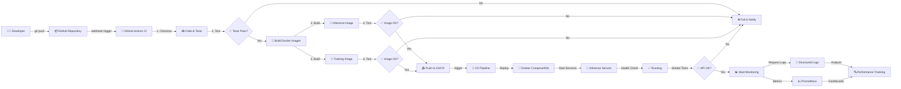

### Data & Model Development Flow (M1)

Modeling workflow showing raw data versioning with DVC, automated preprocessing pipeline stages, model training with MLflow experiment tracking, and artifact version control.

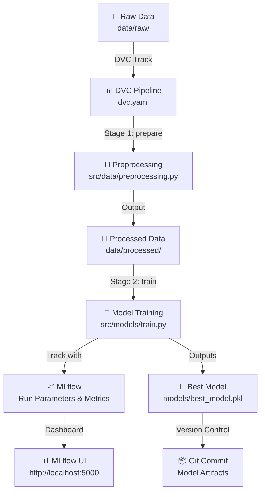

### Containerization & API (M2)

Shows how trained models are loaded into a FastAPI application, exposed through REST endpoints, and packaged into Docker containers for consistent deployment across environments.

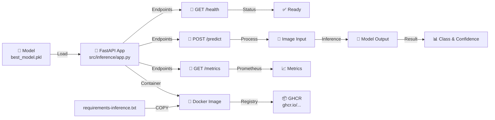

### CI/CD Pipeline Detailed (M3 & M4)

Automated GitHub Actions workflow showing test execution, conditional build triggering using path filters, parallel image building, and automatic push to GHCR registry.

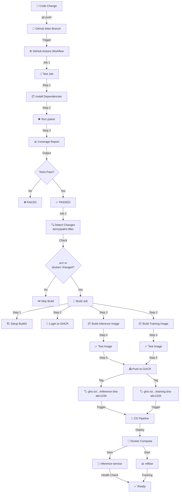

### Deployment & Runtime (M4)

Deployment options showing how images from GHCR are pulled and deployed either via Docker Compose (local) or Kubernetes (production) with replicas, persistent volumes, and monitoring integration.

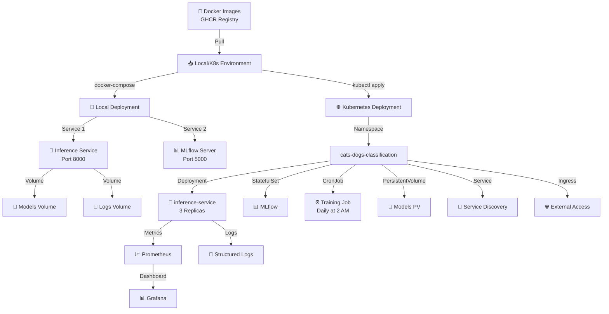

### Monitoring & Observability (M5)

Complete observability stack capturing structured logs, Prometheus metrics collection, model drift detection, and Grafana dashboard visualization for production monitoring.

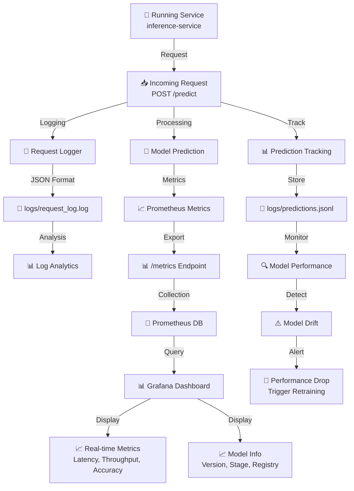

### Data Flow in Production

Real-time request handling showing image upload validation, preprocessing, model inference, asynchronous metrics collection, structured logging, and dashboard reporting.

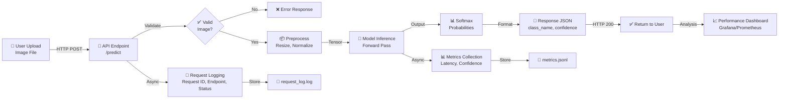

---

### Prerequisites

- Python 3.11+
- Docker & Rancher Desktop (for containerization)
- Git & DVC (for version control)

### Setup Virtual Environment

```bash
# Create virtual environment
python -m venv .venv

# Activate virtual environment
# On Windows (PowerShell):
.venv\Scripts\Activate.ps1
# On Windows (Command Prompt):
.venv\Scripts\activate.bat
# On macOS/Linux:
source .venv/bin/activate

# Install dependencies
pip install -r requirements.txt
```

## 📦 Module Breakdown

### M1: Model Development & Experiment Tracking

#### Tasks:

1. **Data & Code Versioning**

   - Git for source code versioning
   - DVC for dataset versioning
2. **Model Building**

   - SimpleCNN baseline model (custom implementation)
   - ResNet18 alternative model (transfer learning)
   - Save in PyTorch format (.pt)
3. **Experiment Tracking**

   - MLflow integration for experiment tracking
   - Log parameters, metrics, and artifacts

#### Run Model Training:

```bash
# Using the training module
python -m src.models.train

# Or with custom parameters
python -c "from src.models import train_model; train_model(epochs=20, lr=0.001)"
```

#### 📸 MLflow Dashboard Screenshots

| Image | Purpose | Key Features |
|-------|---------|--------------|
| [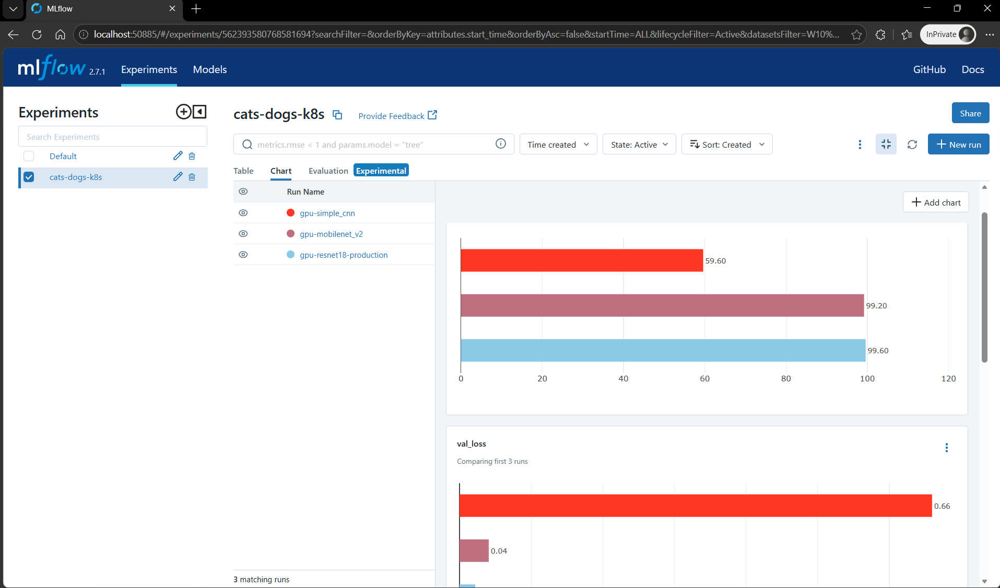](docs/01-m1-model-development.md#mlflow-dashboard-screenshots) | **Experiment Tracking** - Compare multiple GPU training runs | • Multiple model runs<br/>• Accuracy progression: 59.60% → 99.60%<br/>• Hyperparameter comparison<br/>• Validation loss tracking |
| [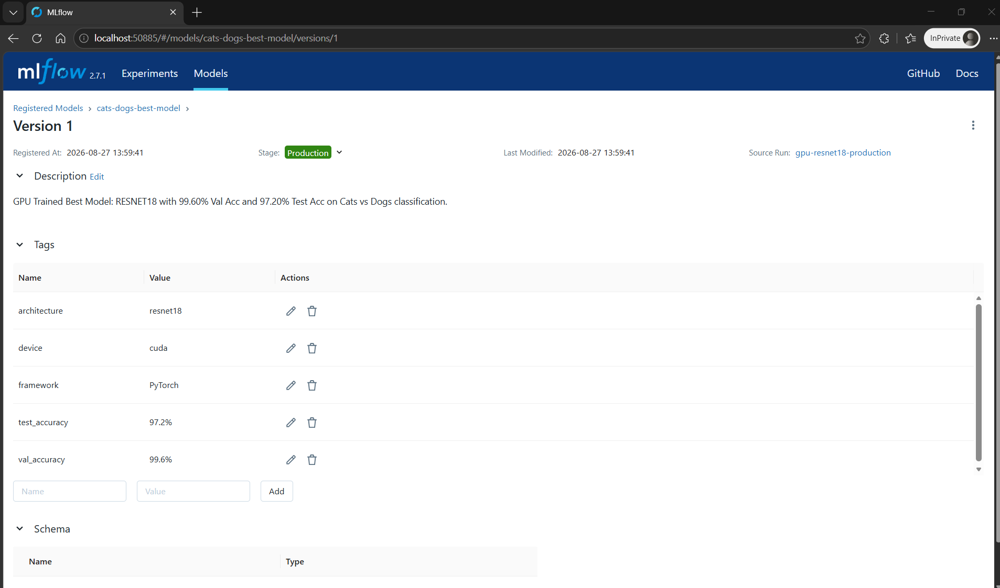](docs/01-m1-model-development.md#mlflow-dashboard-screenshots) | **Model Registry** - Version control and production promotion | • Registered model versioning<br/>• ResNet18 (99.6% val accuracy)<br/>• Production stage assignment<br/>• Model metadata tags |

---

### M2: Model Packaging & Containerization

#### Tasks:

1. **Inference Service**

   - FastAPI REST API with two endpoints:
     - `GET /health` - Health check
     - `POST /predict` - Image classification
   - Additional endpoints: `GET /info`
2. **Environment Specification**

   - `requirements.txt` with pinned versions
   - All dependencies documented
3. **Containerization**

   - Dockerfile for reproducible environments
   - Test locally with Rancher Desktop

#### Run Inference Service Locally:

```bash
# Using FastAPI directly
uvicorn src.inference.app:app --host 0.0.0.0 --port 8000

# Or using Docker
docker build -f docker/Dockerfile -t cats-dogs-classifier .
docker run -p 8000:8000 cats-dogs-classifier
```

#### Test Predictions:

```bash
# Health check
curl http://localhost:8000/health

# Make prediction
curl -F "file=@test_image.jpg" http://localhost:8000/predict

# Get service info
curl http://localhost:8000/info
```

#### 📸 Swagger API & Docker Screenshots

| Image | Purpose | Key Features |
|-------|---------|--------------|
| [](docs/02-m2-packaging.md#api-documentation--testing) | **API Documentation** - Interactive Swagger UI | • Complete endpoint listing<br/>• Request/response schemas<br/>• Try-it-out functionality<br/>• /health, /predict, /metrics, /logs |
| [](docs/02-m2-packaging.md#api-documentation--testing) | **Prediction Example** - Dog classification (99.99% confidence) | • Dog image prediction<br/>• Per-class probabilities<br/>• HTTP 200 response<br/>• Curl command reference |
| [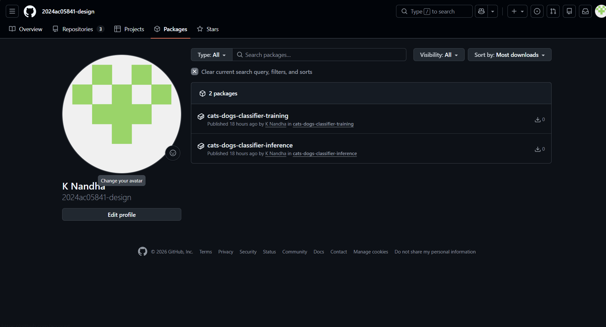](docs/02-m2-packaging.md#containerization) | **Container Registry** - Published images on GHCR | • 2 published images<br/>• cats-dogs-classifier-inference<br/>• cats-dogs-classifier-training<br/>• Automatic versioning & tagging |

---

### M3: CI Pipeline for Build, Test & Image Creation

#### Tasks:

1. **Automated Testing**

   - `tests/test_preprocessing.py` - Data preprocessing tests
   - `tests/test_inference.py` - Model inference tests
   - Run with: `pytest tests/ -v`
2. **CI Setup (GitHub Actions)**

   - Workflow: `.github/workflows/ci.yml`
   - Steps:
     - Checkout repository
     - Install dependencies
     - Run unit tests with coverage
     - Build Docker image
     - Test Docker image locally
3. **Artifact Publishing**

   - Push Docker image to registry (Docker Hub, GHCR, etc.)
   - Supports Docker Hub via secrets
   - Automatic push to GHCR on test success

#### Run Tests Locally:

```bash
# Install test dependencies
pip install pytest pytest-cov

# Run all tests
pytest tests/ -v

# Run with coverage
pytest tests/ --cov=src --cov-report=html
```

#### 📸 GitHub Actions CI Pipeline Screenshots

| Image | Purpose | Key Features |
|-------|---------|---------------|
| [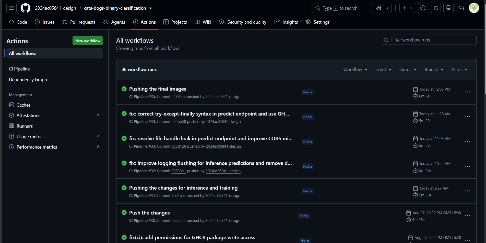](docs/03-m3-ci-pipeline.md#automated-testing) | **Workflow Execution History** - 36 successful CI runs | • All workflow runs shown<br/>• CI Pipeline status: PASSED<br/>• Commit history visible<br/>• Automated on every push |
| [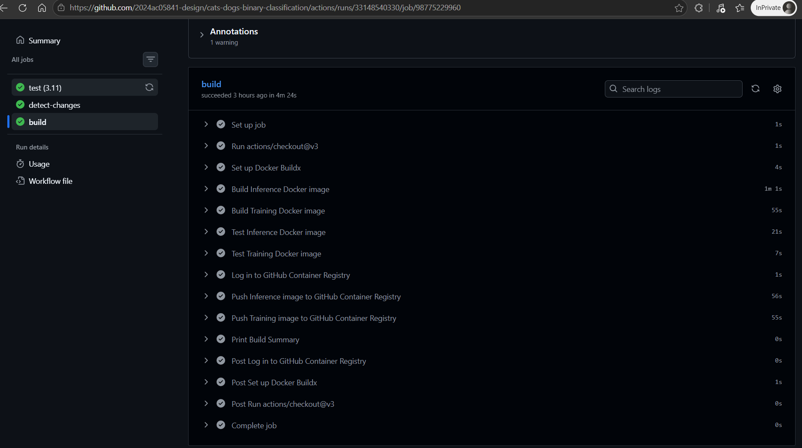](docs/03-m3-ci-pipeline.md#artifact-publishing) | **Build Job Execution** - Successful image build and push | • Test job: 3.11 Python<br/>• Docker build for both images<br/>• Tests passed before build<br/>• Pushed to GHCR registry |

### M4: CD Pipeline & Deployment

#### Tasks:

1. **Deployment Target**

   - Option A: **Docker Compose** (default - recommended for local)
   - Option B: **Kubernetes** (manifests provided)
2. **CD/GitOps Flow**

   - Workflow: `.github/workflows/cd.yml`
   - Auto-deploy on main branch changes
   - Pull new image and restart service
3. **Smoke Tests**

   - Post-deployment validation
   - Script: `smoke_tests.sh`
   - Validates health endpoint and predictions

#### Deploy Locally with Docker Compose:

```bash
# Start services
docker-compose -f docker-compose.yml up -d

# View logs
docker-compose logs -f inference-service

# Run smoke tests
bash smoke_tests.sh

# Stop services
docker-compose down
```

#### Deploy to Kubernetes (if available):

```bash
# Apply manifests
kubectl apply -f k8s/deployment.yaml
kubectl apply -f k8s/service.yaml

# Check deployment
kubectl get deployments
kubectl get services

# Port forward to test
kubectl port-forward svc/cats-dogs-classifier-service 8000:80
```

#### 📸 Kubernetes & Rancher Deployment Screenshots

| Image | Purpose | Key Features |
|-------|---------|--------------|
| [](docs/04-m4-cd-deployment.md#kubernetes-deployment-via-rancher) | **Pod Management** - All services running in namespace | • 5 running pods (1/1 ready)<br/>• inference-service replicas<br/>• MLflow + Prometheus<br/>• Grafana monitoring |
| [](docs/04-m4-cd-deployment.md#kubernetes-deployment-via-rancher) | **Deployment Status** - GHCR image management | • Inference service (1/1 ready)<br/>• GHCR image pull status<br/>• Pod age tracking<br/>• Restart history |
| [](docs/04-m4-cd-deployment.md#kubernetes-deployment-via-rancher) | **Automated Training** - Weekly model retraining | • Schedule: 2 AM Sunday<br/>• Training image from GHCR<br/>• src/gpu_training/train_gpu.py<br/>• Suspended/Active toggle |

---

### M5: Monitoring, Logs & Final Submission

#### Tasks:

1. **Basic Monitoring & Logging**

   - Request/response logging (JSON format)
   - Metrics tracking (request count, latency)
   - Logs stored in `logs/` directory
2. **Model Performance Tracking**

   - Post-deployment prediction collection
   - Accuracy calculation from collected data
   - Data stored in `logs/predictions.jsonl`

#### View Metrics:

```bash
# Check app logs
tail -f logs/app.log

# View metrics in JSON format
cat logs/metrics.jsonl | jq .

# View predictions
cat logs/predictions.jsonl | jq .
```

#### 📸 Prometheus & Grafana Monitoring Screenshots

**Prometheus Metrics Collection:**

| Image | Purpose | Key Features |
|-------|---------|--------------|
| [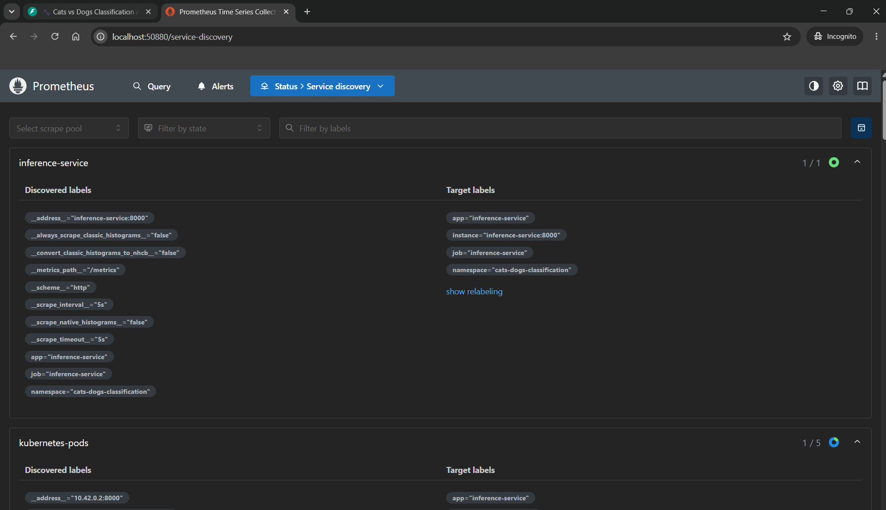](docs/05-m5-monitoring.md#monitoring-dashboards--visualizations) | **Service Discovery** - K8s endpoint configuration | • Discovered targets config<br/>• Target labels mapping<br/>• kubernetes_sd_configs<br/>• Scrape configuration |
| [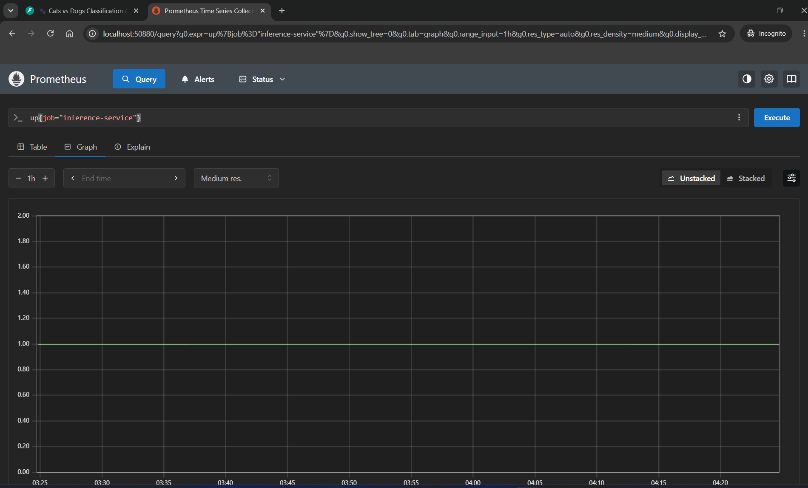](docs/05-m5-monitoring.md#monitoring-dashboards--visualizations) | **Metrics Query** - Uptime monitoring | • Time series execution<br/>• up{job="inference-service"} = 1<br/>• Query visualization<br/>• Metric explorer |
| [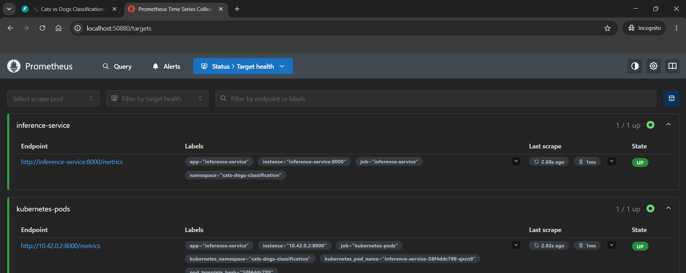](docs/05-m5-monitoring.md#monitoring-dashboards--visualizations) | **Target Status** - All endpoints healthy | • 1/1 targets up<br/>• Endpoint: 10.42.0.2:8000/metrics<br/>• Scrape interval: 5s<br/>• Last scrape: Success |

**Grafana Dashboards:**

| Image | Purpose | Key Features |
|-------|---------|--------------|
| [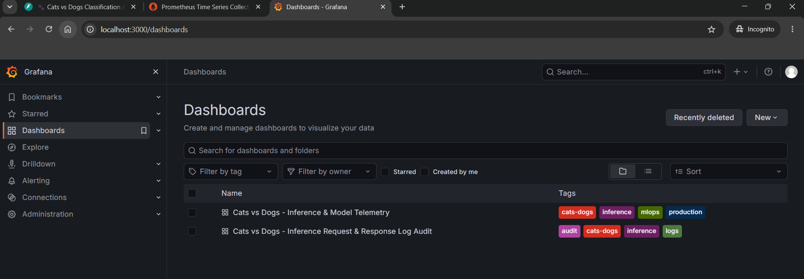](docs/05-m5-monitoring.md#grafana-dashboard-visualizations) | **Dashboard Navigation** - Complete observability suite | • Dashboard list<br/>• Inference & Model Telemetry<br/>• Request & Response Audit<br/>• Create new dashboards |
| [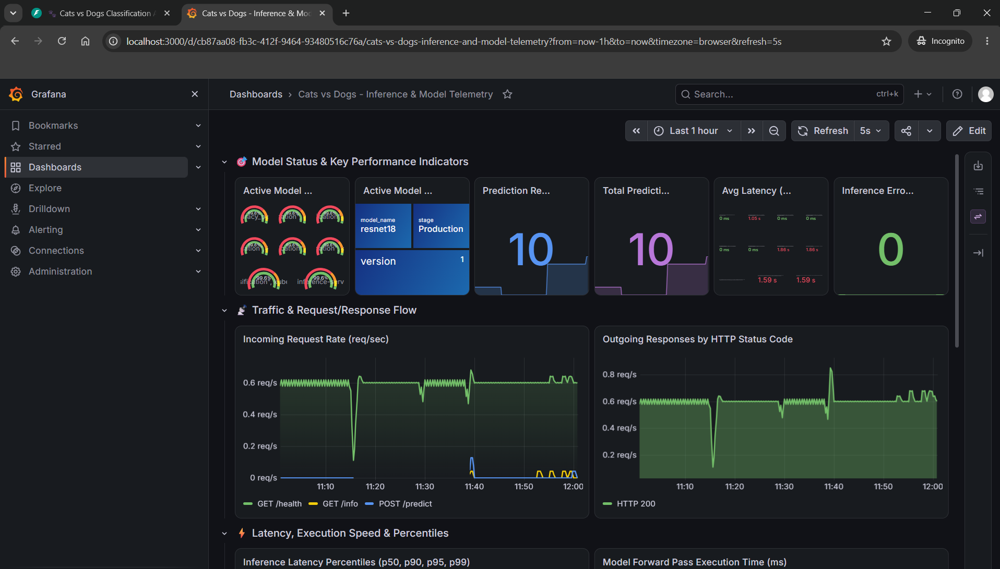](docs/05-m5-monitoring.md#grafana-dashboard-visualizations) | **Model Performance Part 1** - Key KPIs and latency | • Active Model: ResNet18 v1<br/>• Predictions: 10 total<br/>• Avg Latency: 1.59s<br/>• Error Rate: 0 |
| [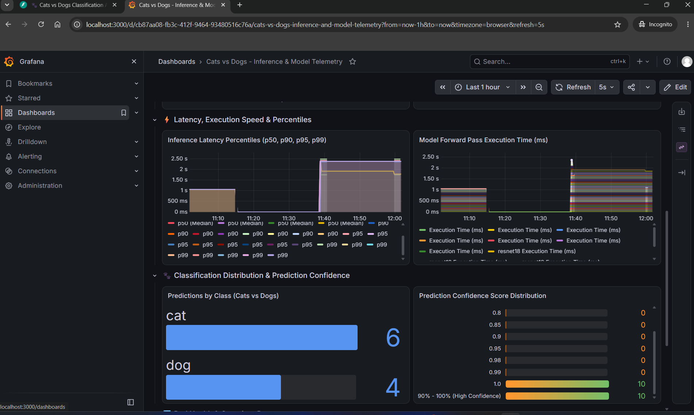](docs/05-m5-monitoring.md#grafana-dashboard-visualizations) | **Model Performance Part 2** - Prediction analysis | • Latency percentiles (p50-p99)<br/>• Predictions: 6 cats, 4 dogs<br/>• Confidence 90%-100%<br/>• Model forward pass time |
| [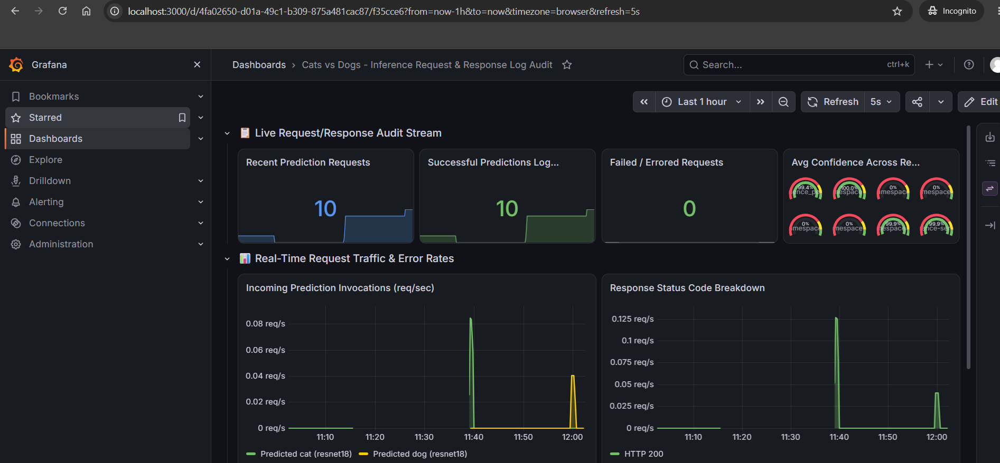](docs/05-m5-monitoring.md#grafana-dashboard-visualizations) | **Request Audit Part 1** - Request tracking and errors | • Total Requests: 10<br/>• Successful: 10<br/>• Failed: 0<br/>• Request rate trend |
| [](docs/05-m5-monitoring.md#grafana-dashboard-visualizations) | **Request Audit Part 2** - Real-time monitoring | • Consistent req/s rate<br/>• 100% HTTP 200 success<br/>• Zero errors<br/>• Live prediction stream |

---

## 🔄 Complete Workflow

### 1. Data Preparation

```bash
# Place raw Cats and Dogs dataset in data/raw/
# Structure: data/raw/cats/, data/raw/dogs/

# Initialize DVC (if not already done)
dvc init

# Track data with DVC
dvc add data/raw
git add data/raw.dvc .gitignore
git commit -m "Add raw dataset"
```

### 2. Train Model

```bash
# Activate virtual environment
# Linux/macOS:
source .venv/bin/activate

# Windows PowerShell:
.venv\Scripts\Activate.ps1

# Train model (MLflow automatically tracks experiments)
python -m src.models.train

# Model saved to models/model.pkl
# Metrics logged to MLflow
```

### 3. Build and Test Locally

```bash
# Run unit tests
pytest tests/ -v

# Build Docker image
docker build -f docker/Dockerfile -t cats-dogs-classifier:latest .

# Test image
docker run -p 8000:8000 cats-dogs-classifier:latest
```

### 4. Deploy Locally with Docker Compose

```bash
# Start services
docker-compose -f docker-compose.yml up -d

# Run smoke tests
bash smoke_tests.sh

# Test prediction
curl -F "file=@test_image.jpg" http://localhost:8000/predict
```

### 5. Push to Git & Trigger CI/CD

```bash
# Add all files
git add .

# Commit changes
git commit -m "Implement complete MLOps pipeline"

# Push to Main branch (triggers CI/CD)
git push origin Main

# GitHub Actions will:
# 1. Run tests
# 2. Build Docker image
# 3. Push to registry
# 4. Deploy using Docker Compose
# 5. Run smoke tests
```

## 📊 Monitoring & Logging

### Log Files

- `logs/app.log` - Application logs in JSON format
- `logs/metrics.jsonl` - Metrics data (one JSON object per line)
- `logs/predictions.jsonl` - Prediction records with true labels

### View Metrics Dashboard (Optional)

```bash
# Start MLflow UI
mlflow ui

# Access at http://localhost:5000
```

## 🛠️ Development

### Environment Variables

```bash
# Linux/macOS (bash):
export MODEL_PATH=models/model.pkl
export LOG_LEVEL=INFO

# Windows (PowerShell):
$env:MODEL_PATH = "models/model.pkl"
$env:LOG_LEVEL = "INFO"
```

### Add New Dependencies

```bash
# Install new package
pip install package_name

# Update requirements
pip freeze > requirements.txt

# Commit changes
git add requirements.txt
git commit -m "Add dependency: package_name"
```

### Run in Development Mode

```bash
# Install dev dependencies
pip install pytest pytest-cov black flake8

# Format code
black src/ tests/

# Lint code
flake8 src/ tests/

# Run tests with coverage
pytest tests/ --cov=src --cov-report=html
```

## 📋 Testing

### Unit Tests

```bash
# Run all tests
pytest tests/ -v

# Run specific test file
pytest tests/test_preprocessing.py -v

# Run specific test function
pytest tests/test_preprocessing.py::TestPreprocessing::test_dataset_loading -v

# Run with coverage report
pytest tests/ --cov=src --cov-report=html
```

### Integration Tests (Manual)

```bash
# Test API endpoints
curl -X GET http://localhost:8000/health
curl -X GET http://localhost:8000/info
curl -X POST -F "file=@test.jpg" http://localhost:8000/predict
```

## 🐳 Docker & Rancher Desktop

### Using Rancher Desktop

1. Install Rancher Desktop from https://rancherdesktop.io/
2. Enable Kubernetes (optional, for K8s deployment)
3. Docker CLI works seamlessly with Rancher Desktop

```bash
# Build image (uses Rancher Desktop's Docker)
docker build -f docker/Dockerfile -t cats-dogs-classifier .

# Run container
docker run -p 8000:8000 cats-dogs-classifier

# Access service
curl http://localhost:8000/health

# For Windows PowerShell, use:
# docker run -p 8000:8000 cats-dogs-classifier
```

## 📝 Documentation

- **DVC Pipelines**: `dvc.yaml` - Defines data and model versioning
- **CI/CD Workflows**: `.github/workflows/` - GitHub Actions automation
- **Kubernetes Manifests**: `k8s/` - Deployment and service definitions
- **API Documentation**: http://localhost:8000/docs (Swagger UI when service is running)

## 🚨 Troubleshooting

### Model Not Loading

```bash
# Check if model file exists (Linux/macOS)
ls -la models/model.pkl

# On Windows PowerShell:
Get-Item models/model.pkl

# Verify model path in environment (Linux/macOS)
echo $MODEL_PATH

# On Windows PowerShell:
$env:MODEL_PATH
```

### Docker Build Fails

```bash
# Check Docker is running
docker ps

# Clear build cache and retry
docker build --no-cache -f docker/Dockerfile -t cats-dogs-classifier .
```

### Service Not Responding

```bash
# Check container logs
docker logs <container_id>

# Verify port is not in use (Linux/macOS)
netstat -tuln | grep 8000

# On Windows PowerShell:
netstat -ano | findstr :8000

# Restart container
docker restart <container_id>
```

### Tests Failing

```bash
# Check Python version
python --version  # Should be 3.11+

# Reinstall dependencies
pip install --upgrade -r requirements.txt

# Clear cache and retry
pytest --cache-clear tests/
```

## 📦 Deliverables

### Ready for Submission:

1. ✅ Source code (all modules implemented)
2. ✅ Configuration files (DVC, CI/CD, Docker, deployment manifests)
3. ✅ Trained model artifacts (models/model.pkl)
4. ✅ Unit tests (test_preprocessing.py, test_inference.py)
5. ✅ Docker container image (Dockerfile)
6. ✅ CI/CD workflows (GitHub Actions)
7. ✅ Deployment manifests (Docker Compose & Kubernetes)
8. ✅ Monitoring and logging (logs/, metrics/)

### To Create Final Submission:

```bash
# Create zip file with all artifacts
git archive --format zip HEAD > MLOps_Assignment_2.zip

# OR manually:
zip -r MLOps_Assignment_2.zip . -x ".git/*" ".venv/*" "__pycache__/*" "mlruns/*" "logs/*"
```

## 🔗 References

- [PyTorch Documentation](https://pytorch.org/)
- [FastAPI Documentation](https://fastapi.tiangolo.com/)
- [MLflow Documentation](https://mlflow.org/)
- [DVC Documentation](https://dvc.org/)
- [Docker Documentation](https://docs.docker.com/)
- [GitHub Actions Documentation](https://docs.github.com/en/actions)

## 📄 License

This project is for educational purposes.

---

**Last Updated**: 2024
**Status**: Ready for git push
