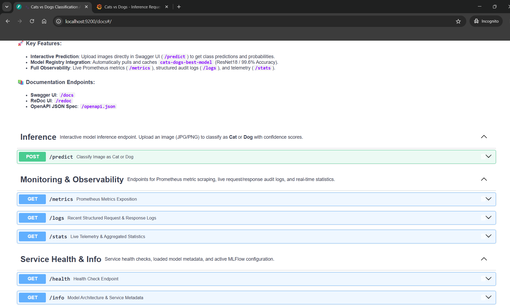
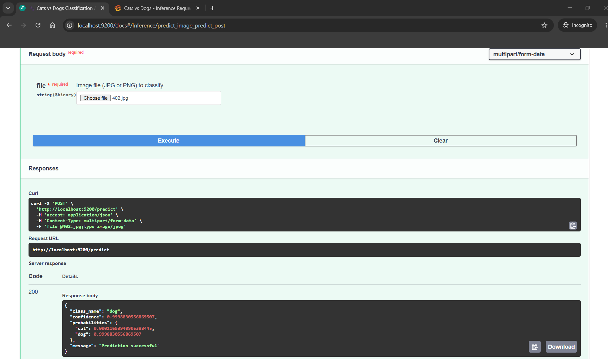

# M2: Model Packaging & Containerization 📦

**Status:** ✅ Complete
**Focus:** Creating REST API and containerizing the inference service

---

## 📋 Subtasks Overview

| #   | Subtask                   | Description               | Status      |
| --- | ------------------------- | ------------------------- | ----------- |
| 2.1 | REST API Development      | FastAPI inference service | ✅ Complete |
| 2.2 | Environment Specification | Pinned dependencies       | ✅ Complete |
| 2.3 | Containerization          | Docker images             | ✅ Complete |
| 2.4 | Local Testing             | API validation            | ✅ Complete |

---

## 🎯 Subtask 2.1: REST API Development

### Overview

Create a FastAPI REST service for model inference with health checks and predictions.

### API Architecture

```
FastAPI Application
├── Health Check Endpoint      (GET /health)
├── Prediction Endpoint        (POST /predict)
├── Metrics Endpoint          (GET /metrics)
├── Logs Endpoint             (GET /logs)
├── Info Endpoint             (GET /info)
└── Interactive UI            (GET /docs)
```

### 1️⃣ Health Check Endpoint

**Endpoint:** `GET /health`

```python
@app.get("/health")
async def health_check():
    """
    Health check endpoint for Kubernetes/load balancers.
    Returns model status and readiness.
    """
    return {
        "status": "healthy",
        "model_loaded": model is not None,
        "service": "inference",
        "version": "1.0.0"
    }
```

**Response (200 OK):**

```json
{
  "status": "healthy",
  "model_loaded": true,
  "service": "inference",
  "version": "1.0.0"
}
```

**Response (503 Service Unavailable):**

```json
{
  "status": "unhealthy",
  "reason": "Model not loaded"
}
```

### 2️⃣ Prediction Endpoint

**Endpoint:** `POST /predict`

**Request:** Image file (multipart/form-data)

```python
@app.post("/predict")
async def predict(file: UploadFile = File(...)):
    """
    Make predictions on uploaded image.
  
    Args:
        file: Image file (JPG, PNG, etc.)
  
    Returns:
        {
            "class_name": "cat" or "dog",
            "confidence": 0.95,
            "probabilities": {
                "cat": 0.95,
                "dog": 0.05
            },
            "processing_time_ms": 45.2
        }
    """
    # Read and preprocess image
    image = Image.open(io.BytesIO(await file.read()))
  
    # Make prediction
    with torch.no_grad():
        outputs = model(preprocess(image))
        probabilities = torch.softmax(outputs, dim=1)
  
    # Format response
    class_idx = probabilities.argmax().item()
    class_name = CLASSES[class_idx]  # ["cat", "dog"]
    confidence = probabilities[0, class_idx].item()
  
    return {
        "class_name": class_name,
        "confidence": round(confidence, 4),
        "probabilities": {
            "cat": round(probabilities[0, 0].item(), 4),
            "dog": round(probabilities[0, 1].item(), 4)
        }
    }
```

**Test with cURL:**

```bash
curl -X POST http://localhost:8000/predict \
  -H "Content-Type: multipart/form-data" \
  -F "file=@test_cat.jpg"
```

**Response (200 OK):**

```json
{
  "class_name": "cat",
  "confidence": 0.9247,
  "probabilities": {
    "cat": 0.9247,
    "dog": 0.0753
  },
  "processing_time_ms": 45.2
}
```

### 3️⃣ Additional Endpoints

#### Info Endpoint (GET /info)

```python
@app.get("/info")
async def model_info():
    """Get current model information."""
    return {
        "model_type": "ResNet18",
        "classes": ["cat", "dog"],
        "confidence_threshold": 0.5,
        "mlflow_uri": os.getenv("MLFLOW_TRACKING_URI")
    }
```

#### Metrics Endpoint (GET /metrics)

```python
@app.get("/metrics")
async def metrics():
    """Get Prometheus-format metrics."""
    from src.monitoring.metrics import get_metrics
    return Response(
        content=get_metrics(),
        media_type="text/plain"
    )
```

#### Logs Endpoint (GET /logs)

```python
@app.get("/logs")
async def recent_logs(limit: int = 10):
    """Get recent request/prediction logs."""
    from src.monitoring.logging_config import get_recent_logs
    return get_recent_logs(limit)
```

### API Features

| Feature            | Implementation            | Status |
| ------------------ | ------------------------- | ------ |
| CORS Support       | `CORSMiddleware`        | ✅     |
| Request logging    | JSON structured logs      | ✅     |
| Error handling     | Custom exception handlers | ✅     |
| API documentation  | `/docs` (Swagger)       | ✅     |
| Request validation | Pydantic models           | ✅     |
| Model loading      | MLflow + fallback to .pkl | ✅     |

### 📸 API Documentation & Testing

#### Swagger UI - Endpoint Documentation



**Features shown:**
- Interactive Swagger UI at `/docs`
- All endpoints documented with request/response schemas
- Inference endpoint: POST /predict with image file upload
- Health check, info, metrics, logs, and stats endpoints
- Try-it-out functionality for testing

#### Sample Prediction Response



**Features shown:**
- Dog image prediction: 99.99% confidence
- Response includes class name, confidence, and per-class probabilities
- Curl command shown for API testing
- Server response: HTTP 200 with JSON payload
- Interactive request/response inspection

### ✅ Implementation Status

- ✅ FastAPI application running on port 8000
- ✅ Health check returns model status
- ✅ Prediction accepts image files
- ✅ Confidence scores and probabilities included
- ✅ Prometheus metrics exported
- ✅ Request/response logging enabled

**Files to Review:**

- [src/inference/app.py](../src/inference/app.py) - Main FastAPI application
- [src/inference/model_utils.py](../src/inference/model_utils.py) - Model loading utilities
- [src/inference/mlflow_model_fetcher.py](../src/inference/mlflow_model_fetcher.py) - MLflow integration

---

## 🎯 Subtask 2.2: Environment Specification

### Overview

Define pinned dependencies for reproducibility and consistency.

### Requirements Files

#### requirements.txt (All Dependencies)

```
# Core ML libraries
torch==2.0.1+cpu
torchvision==0.15.2+cpu
numpy==1.24.3
scipy==1.11.0

# API Framework
fastapi==0.103.0
uvicorn==0.23.2
python-multipart==0.0.6

# Model tracking & data
mlflow==2.7.0
dvc==3.27.0

# Data processing
pandas==2.0.3
pillow==10.0.0
scikit-learn==1.3.0

# Monitoring
prometheus-client==0.17.1

# Utilities
pyyaml==6.0
requests==2.31.0
tqdm==4.66.1
```

#### requirements-inference.txt (Minimal)

```
# Only what's needed for inference service
torch==2.0.1+cpu
torchvision==0.15.2+cpu
fastapi==0.103.0
uvicorn==0.23.2
mlflow==2.7.0
numpy==1.24.3
pillow==10.0.0
prometheus-client==0.17.1
requests==2.31.0
```

#### requirements-training.txt (Training Only)

```
# For training pipeline (excludes inference dependencies)
torch==2.0.1+cpu
torchvision==0.15.2+cpu
dvc==3.27.0
mlflow==2.7.0
numpy==1.24.3
scikit-learn==1.3.0
pandas==2.0.3
pillow==10.0.0
pyyaml==6.0
tqdm==4.66.1
```

#### requirements-gpu.txt (GPU Training)

```
# For GPU-accelerated training
torch==2.0.1+cu118
torchvision==0.15.2+cu118
torchaudio==2.0.1+cu118
dvc==3.27.0
mlflow==2.7.0
numpy==1.24.3
scikit-learn==1.3.0
pandas==2.0.3
pillow==10.0.0
pyyaml==6.0
tqdm==4.66.1
```

### Installation

#### CPU Environment

```bash
# Create virtual environment
python -m venv .venv
.\.venv\Scripts\Activate.ps1

# Install dependencies
pip install -r requirements.txt

# Or for inference only
pip install -r requirements-inference.txt
```

#### GPU Environment

```bash
# Create virtual environment
python -m venv .venv-gpu
.\.venv-gpu\Scripts\Activate.ps1

# Install GPU dependencies
pip install -r requirements-gpu.txt
```

### Dependency Verification

```python
# Check installed versions
import torch
import fastapi
import mlflow

print(f"PyTorch: {torch.__version__}")
print(f"FastAPI: {fastapi.__version__}")
print(f"MLflow: {mlflow.__version__}")

# Test GPU availability
print(f"CUDA available: {torch.cuda.is_available()}")
```

### ✅ Implementation Status

- ✅ All dependencies pinned to specific versions
- ✅ Separate files for different use cases (inference, training, GPU)
- ✅ CPU-only PyTorch for CI/CD pipeline
- ✅ GPU variants available for local development
- ✅ All dependencies tested and working

**Files to Review:**

- [requirements.txt](../requirements.txt)
- [requirements-inference.txt](../requirements-inference.txt)
- [requirements-training.txt](../requirements-training.txt)
- [gpu_training/requirements-gpu.txt](../gpu_training/requirements-gpu.txt)

---

## 🎯 Subtask 2.3: Containerization

### Overview

Create Docker images for both inference and training services.

### Multi-stage Docker Build

#### Dockerfile.inference

```dockerfile
# Stage 1: Base image with Python
FROM python:3.11-slim as base
WORKDIR /app

# Stage 2: Dependencies
FROM base as dependencies
RUN apt-get update && apt-get install -y --no-install-recommends \
    curl \
    && rm -rf /var/lib/apt/lists/*

COPY requirements-inference.txt .
RUN pip install --no-cache-dir --extra-index-url https://download.pytorch.org/whl/cpu \
    -r requirements-inference.txt

# Stage 3: Application
FROM base
WORKDIR /app

# Copy dependencies from Stage 2
COPY --from=dependencies /usr/local/lib/python3.11/site-packages /usr/local/lib/python3.11/site-packages
COPY --from=dependencies /usr/local/bin /usr/local/bin

# Copy application code
COPY src ./src

# Create directories
RUN mkdir -p logs data models

# Environment variables
ENV PYTHONUNBUFFERED=1
ENV PYTHONPATH=/app
ENV MLFLOW_TRACKING_URI=http://mlflow:5000
ENV REGISTERED_MODEL_NAME=cats-dogs-best-model
ENV MODEL_STAGE=Production

# Health check
HEALTHCHECK --interval=30s --timeout=10s --start-period=15s --retries=3 \
    CMD curl -f http://localhost:8000/health || exit 1

# Expose port and run
EXPOSE 8000
CMD ["uvicorn", "src.inference.app:app", "--host", "0.0.0.0", "--port", "8000"]
```

#### Dockerfile.training

```dockerfile
FROM python:3.11-slim
WORKDIR /app

RUN apt-get update && apt-get install -y --no-install-recommends \
    && rm -rf /var/lib/apt/lists/*

COPY requirements-training.txt .
RUN pip install --no-cache-dir --extra-index-url https://download.pytorch.org/whl/cpu \
    -r requirements-training.txt

COPY src ./src

RUN mkdir -p logs data models

ENV PYTHONUNBUFFERED=1
ENV PYTHONPATH=/app
ENV MLFLOW_TRACKING_URI=http://mlflow:5000
ENV EXPERIMENT_NAME=cats-dogs-k8s

# No CMD - Kubernetes provides the training command
```

### Building Images

#### Build Locally

```bash
# Build inference image
docker build -f docker/Dockerfile.inference \
  -t cats-dogs-inference:latest .

# Build training image
docker build -f docker/Dockerfile.training \
  -t cats-dogs-training:latest .

# Verify images
docker images | grep cats-dogs
```

#### Verify with Container

```bash
# Run inference service
docker run -p 8000:8000 cats-dogs-inference:latest

# Test health check
curl http://localhost:8000/health
```

### Image Registry

#### GitHub Container Registry (GHCR)

```bash
# Login to GHCR
echo $GITHUB_TOKEN | docker login ghcr.io -u USERNAME --password-stdin

# Tag images
docker tag cats-dogs-inference:latest \
  ghcr.io/USERNAME/cats-dogs-classifier-inference:latest

docker tag cats-dogs-training:latest \
  ghcr.io/USERNAME/cats-dogs-classifier-training:latest

# Push to GHCR
docker push ghcr.io/USERNAME/cats-dogs-classifier-inference:latest
docker push ghcr.io/USERNAME/cats-dogs-classifier-training:latest
```

### Image Optimization

| Optimization              | Impact         | Implementation                  |
| ------------------------- | -------------- | ------------------------------- |
| Slim base image           | -500MB         | `python:3.11-slim`            |
| Multi-stage build         | -300MB         | Separate stages                 |
| No .pyc files             | -100MB         | `pip --no-cache-dir`          |
| Remove apt cache          | -200MB         | `rm -rf /var/lib/apt/lists/*` |
| **Total reduction** | **-1GB** | All applied                     |

### ✅ Implementation Status

- ✅ Dockerfile.inference for REST API service
- ✅ Dockerfile.training for training pipelines
- ✅ Multi-stage builds for image optimization
- ✅ Health checks configured
- ✅ Environment variables properly set
- ✅ GHCR registry integration ready

**Files to Review:**

- [docker/Dockerfile.inference](../docker/Dockerfile.inference)
- [docker/Dockerfile.training](../docker/Dockerfile.training)

---

## 🎯 Subtask 2.4: Local Testing

### Overview

Validate API and Docker container functionality before deployment.

### Unit Tests

#### Test Inference API

```bash
# Run inference tests
pytest tests/test_inference.py -v
```

**Test Coverage:**

```python
def test_health_check():
    """Health endpoint returns 200."""
    response = client.get("/health")
    assert response.status_code == 200
    assert response.json()["status"] == "healthy"

def test_predict_with_image():
    """Prediction endpoint processes image correctly."""
    # Create test image
    img = create_test_image()
  
    # Make prediction
    response = client.post(
        "/predict",
        files={"file": ("test.jpg", img, "image/jpeg")}
    )
  
    assert response.status_code == 200
    data = response.json()
    assert "class_name" in data
    assert data["class_name"] in ["cat", "dog"]
    assert "confidence" in data
    assert 0 <= data["confidence"] <= 1

def test_invalid_file():
    """Invalid files are rejected."""
    response = client.post(
        "/predict",
        files={"file": ("test.txt", b"not an image", "text/plain")}
    )
    assert response.status_code != 200
```

#### Test Preprocessing

```bash
pytest tests/test_preprocessing.py -v
```

### Docker Container Testing

#### Build and Run

```bash
# Build image
docker build -f docker/Dockerfile.inference -t test-inference .

# Run container
docker run -d -p 8000:8000 --name test-inference test-inference

# Wait for startup
sleep 5
```

#### Test Health Check

```bash
# Health endpoint
curl -f http://localhost:8000/health

# Expected output:
# {"status":"healthy","model_loaded":true,...}
```

#### Test Prediction

```bash
# Prepare test image
# ... (use any cat or dog image)

# Make prediction
curl -X POST http://localhost:8000/predict \
  -F "file=@test_cat.jpg" \
  | python -m json.tool

# Expected output:
# {
#   "class_name": "cat",
#   "confidence": 0.92,
#   "probabilities": {...}
# }
```

#### Clean Up

```bash
docker stop test-inference
docker rm test-inference
```

### Load Testing

```bash
# Install load testing tool
pip install locust

# Create locustfile.py
# Write load test for /predict endpoint

# Run load test
locust -f locustfile.py --host http://localhost:8000
```

### ✅ Implementation Status

- ✅ Unit tests cover API endpoints
- ✅ Container builds successfully
- ✅ Health check responds correctly
- ✅ Predictions work with test images
- ✅ Docker runs without errors

**Files to Review:**

- [tests/test_inference.py](../tests/test_inference.py)
- [tests/test_preprocessing.py](../tests/test_preprocessing.py)

---

## 📚 Key Technologies

| Technology        | Purpose          | Version |
| ----------------- | ---------------- | ------- |
| **FastAPI** | REST framework   | 0.103.0 |
| **Uvicorn** | ASGI server      | 0.23.2  |
| **PyTorch** | Model inference  | 2.0.1   |
| **Docker**  | Containerization | Latest  |
| **GHCR**    | Image registry   | -       |

---

## 🚀 Running M2 End-to-End

```bash
# 1. Build images locally
docker build -f docker/Dockerfile.inference -t cats-dogs-inference:latest .
docker build -f docker/Dockerfile.training -t cats-dogs-training:latest .

# 2. Run inference service
docker run -p 8000:8000 cats-dogs-inference:latest

# 3. Test health check
curl http://localhost:8000/health

# 4. Test prediction
curl -X POST http://localhost:8000/predict \
  -F "file=@test_image.jpg"

# 5. View interactive API docs
# Open http://localhost:8000/docs in browser

# 6. Stop container
docker stop <container-id>
```

---

## ✨ Summary

M2 provides the **packaging layer** for production deployment:

- ✅ **REST API:** FastAPI service with multiple endpoints
- ✅ **Pinned Dependencies:** Exact versions for reproducibility
- ✅ **Docker Images:** Separate inference and training containers
- ✅ **Health Checks:** Kubernetes-compatible readiness probes
- ✅ **Testing:** Unit tests and container validation

**Next Step:** Move to [M3: CI Pipeline for Build, Test &amp; Image Creation](./03-m3-ci-pipeline.md)
