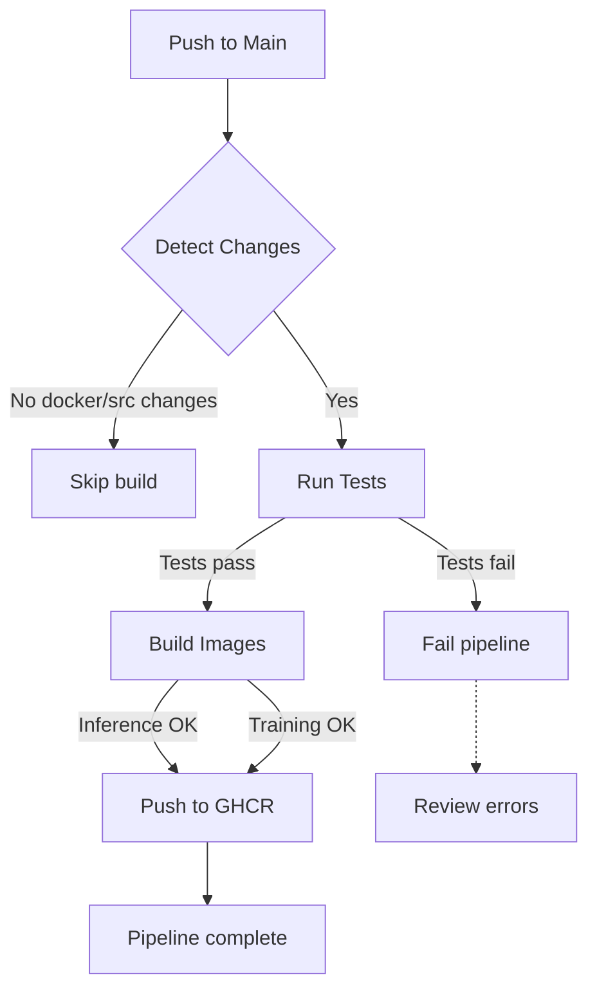

# M3: CI Pipeline for Build, Test & Image Creation 🔄

**Status:** ✅ Complete
**Focus:** Automated testing and Docker image building with GitHub Actions

---

## 📋 Subtasks Overview

| #   | Subtask                   | Description            | Status      |
| --- | ------------------------- | ---------------------- | ----------- |
| 3.1 | Automated Testing         | Unit test execution    | ✅ Complete |
| 3.2 | CI Setup (GitHub Actions) | Workflow configuration | ✅ Complete |
| 3.3 | Docker Image Building     | Multi-image builds     | ✅ Complete |
| 3.4 | Artifact Publishing       | Push to GHCR           | ✅ Complete |

---

## 🎯 Subtask 3.1: Automated Testing

### Overview

Run unit tests automatically on every code push using pytest.

### Test Structure

```
tests/
├── __init__.py
├── test_preprocessing.py        # Data preprocessing tests
├── test_inference.py            # Model inference tests
└── conftest.py                  # Pytest fixtures (if needed)
```

### 1️⃣ Preprocessing Tests

**File:** `tests/test_preprocessing.py`

```python
import pytest
from pathlib import Path
from PIL import Image
import tempfile

from src.data.preprocessing import preprocess_image, load_image

class TestPreprocessing:
  
    @pytest.fixture
    def sample_image(self):
        """Create a sample test image."""
        img = Image.new('RGB', (256, 256), color='red')
        with tempfile.NamedTemporaryFile(suffix='.jpg', delete=False) as f:
            img.save(f.name)
            return f.name
  
    def test_load_image(self, sample_image):
        """Test image loading."""
        img = load_image(sample_image)
        assert img is not None
        assert img.size == (224, 224)  # After preprocessing
        assert img.mode == 'RGB'
  
    def test_preprocess_transforms(self, sample_image):
        """Test image preprocessing transforms."""
        preprocessed = preprocess_image(sample_image)
      
        # Check tensor properties
        assert isinstance(preprocessed, torch.Tensor)
        assert preprocessed.shape == (1, 3, 224, 224)
        assert preprocessed.dtype == torch.float32
        assert preprocessed.min() >= -1.0
        assert preprocessed.max() <= 1.0
  
    def test_invalid_image(self):
        """Test handling of invalid images."""
        with pytest.raises(Exception):
            load_image("nonexistent.jpg")
  
    def test_image_validation(self, sample_image):
        """Test image validation."""
        img = load_image(sample_image)
        assert img is not None
```

### 2️⃣ Inference Tests

**File:** `tests/test_inference.py`

```python
import pytest
from src.models.cnn_model import create_model
from src.inference.model_utils import load_model, predict
import torch

class TestModelUtils:
  
    @pytest.fixture
    def model(self):
        """Load test model."""
        return create_model('SimpleCNN', num_classes=2, device='cpu')
  
    @pytest.fixture
    def test_image(self):
        """Create test image tensor."""
        return torch.randn(1, 3, 224, 224)
  
    def test_model_creation(self, model):
        """Test model is created correctly."""
        assert model is not None
        assert isinstance(model, torch.nn.Module)
  
    def test_model_forward_pass(self, model, test_image):
        """Test model forward pass."""
        model.eval()
        with torch.no_grad():
            output = model(test_image)
      
        assert output.shape == (1, 2)  # Batch size 1, 2 classes
        assert output.dtype == torch.float32
  
    def test_prediction_output_format(self, model, test_image):
        """Test prediction output format."""
        model.eval()
        with torch.no_grad():
            probs = torch.softmax(model(test_image), dim=1)
      
        assert probs.shape == (1, 2)
        assert torch.allclose(probs.sum(), torch.tensor(1.0), atol=1e-6)
        assert (probs >= 0).all() and (probs <= 1).all()
  
    def test_multiple_models(self):
        """Test all model architectures."""
        models = ['SimpleCNN', 'ResNet18', 'LogisticRegression']
      
        for model_name in models:
            model = create_model(model_name, num_classes=2, device='cpu')
            assert model is not None
          
            # Test forward pass
            test_input = torch.randn(1, 3, 224, 224)
            with torch.no_grad():
                output = model(test_input)
            assert output.shape[1] == 2
```

### Running Tests

```bash
# Run all tests
pytest tests/ -v

# Run specific test file
pytest tests/test_preprocessing.py -v

# Run with coverage report
pytest tests/ -v --cov=src --cov-report=html

# Run with markers
pytest tests/ -v -m "preprocessing"
```

### Test Output Example

```
tests/test_preprocessing.py::TestPreprocessing::test_load_image PASSED      [ 16%]
tests/test_preprocessing.py::TestPreprocessing::test_preprocess_transforms PASSED [ 33%]
tests/test_preprocessing.py::TestPreprocessing::test_invalid_image PASSED     [ 50%]
tests/test_preprocessing.py::TestPreprocessing::test_image_validation PASSED  [ 66%]
tests/test_inference.py::TestModelUtils::test_model_creation PASSED           [ 83%]
tests/test_inference.py::TestModelUtils::test_model_forward_pass PASSED       [100%]

========================= 6 passed in 2.34s ==========================
```

### ✅ Implementation Status

- ✅ Preprocessing tests validate data loading
- ✅ Inference tests verify model outputs
- ✅ Tests cover all model architectures
- ✅ All tests passing locally
- ✅ Coverage reporting enabled

**Files to Review:**

- [tests/test_preprocessing.py](../tests/test_preprocessing.py)
- [tests/test_inference.py](../tests/test_inference.py)

---

## 🎯 Subtask 3.2: GitHub Actions CI Setup

### Overview

Configure automated CI pipeline that runs on every push to the Main branch.

### GitHub Actions Workflow

**File:** `.github/workflows/ci.yml`

```yaml
name: CI/CD Pipeline

on:
  push:
    branches:
      - Main
    paths:
      - 'src/**'
      - 'tests/**'
      - 'docker/**'
      - 'requirements*.txt'
      - '.github/workflows/ci.yml'
  
  pull_request:
    branches:
      - Main

concurrency:
  group: ci-${{ github.ref }}
  cancel-in-progress: true

permissions:
  contents: read
  packages: write

jobs:
  # Job 1: Run unit tests
  test:
    runs-on: ubuntu-latest
  
    strategy:
      matrix:
        python-version: ['3.11']
  
    steps:
      - uses: actions/checkout@v4
    
      - name: Set up Python ${{ matrix.python-version }}
        uses: actions/setup-python@v4
        with:
          python-version: ${{ matrix.python-version }}
    
      - name: Install dependencies
        run: |
          python -m pip install --upgrade pip
          pip install -r requirements.txt
          pip install pytest pytest-cov
    
      - name: Run unit tests
        run: |
          pytest tests/ -v --cov=src --cov-report=xml
    
      - name: Upload coverage
        uses: codecov/codecov-action@v3
        with:
          files: ./coverage.xml
          flags: unittests

  # Job 2: Detect changed files
  detect-changes:
    runs-on: ubuntu-latest
    outputs:
      build_images: ${{ steps.filter.outputs.docker == 'true' || steps.filter.outputs.src == 'true' }}
  
    steps:
      - uses: actions/checkout@v4
    
      - uses: dorny/paths-filter@v2
        id: filter
        with:
          filters: |
            docker:
              - 'docker/**'
            src:
              - 'src/**'
            requirements:
              - 'requirements*.txt'

  # Job 3: Build Docker images
  build:
    needs: [test, detect-changes]
    if: needs.detect-changes.outputs.build_images == 'true'
    runs-on: ubuntu-latest
  
    strategy:
      matrix:
        include:
          - dockerfile: docker/Dockerfile.inference
            image: cats-dogs-classifier-inference
            context: .
          - dockerfile: docker/Dockerfile.training
            image: cats-dogs-classifier-training
            context: .
  
    steps:
      - uses: actions/checkout@v4
    
      - name: Set up Docker Buildx
        uses: docker/setup-buildx-action@v2
    
      - name: Log in to GHCR
        uses: docker/login-action@v2
        with:
          registry: ghcr.io
          username: ${{ github.actor }}
          password: ${{ secrets.GITHUB_TOKEN }}
    
      - name: Extract metadata
        id: meta
        uses: docker/metadata-action@v4
        with:
          images: ghcr.io/${{ github.repository_owner }}/${{ matrix.image }}
          tags: |
            type=sha,prefix=sha-
            type=ref,event=branch
            type=semver,pattern={{version}}
    
      - name: Build and test image
        uses: docker/build-push-action@v4
        with:
          context: ${{ matrix.context }}
          file: ${{ matrix.dockerfile }}
          push: false
          load: true
          tags: test-${{ matrix.image }}:latest
    
      - name: Test image
        run: |
          docker run --rm test-${{ matrix.image }}:latest \
            python -c "import torch, fastapi, mlflow; print('✓ All dependencies OK')"
    
      - name: Build and push image
        uses: docker/build-push-action@v4
        with:
          context: ${{ matrix.context }}
          file: ${{ matrix.dockerfile }}
          push: true
          tags: ${{ steps.meta.outputs.tags }}
          labels: ${{ steps.meta.outputs.labels }}

  # Job 4: Build summary
  summary:
    runs-on: ubuntu-latest
    needs: [test, build]
    if: always()
  
    steps:
      - name: Print summary
        run: |
          echo "✅ Tests: ${{ needs.test.result }}"
          echo "✅ Build: ${{ needs.build.result }}"
```

### Workflow Triggers

| Event                    | Condition                                           | Action                                 |
| ------------------------ | --------------------------------------------------- | -------------------------------------- |
| **Push to Main**   | Code changes in src/, tests/, docker/, requirements | Run tests + build images               |
| **Pull Request**   | Against Main branch                                 | Run tests only (no build)              |
| **Manual Trigger** | Via Actions tab                                     | Can be added with`workflow_dispatch` |

### Concurrency Control

```yaml
concurrency:
  group: ci-${{ github.ref }}  # Group by branch
  cancel-in-progress: true     # Cancel old runs
```

**Effect:**

- Only one CI pipeline runs per branch
- Newer pushes cancel previous runs
- Saves resources and time

### ✅ Implementation Status

- ✅ CI workflow triggers on code changes
- ✅ Tests run on ubuntu-latest
- ✅ Coverage reports uploaded
- ✅ Path-based filtering enabled
- ✅ Concurrency control configured
- ✅ GHCR permissions granted

**Files to Review:**

- [.github/workflows/ci.yml](../.github/workflows/ci.yml)

---

## 🎯 Subtask 3.3: Docker Image Building

### Overview

Build both inference and training Docker images as part of CI pipeline.

### Multi-Image Build Strategy

```yaml
strategy:
  matrix:
    include:
      - dockerfile: docker/Dockerfile.inference
        image: cats-dogs-classifier-inference
      - dockerfile: docker/Dockerfile.training
        image: cats-dogs-classifier-training
```

**Benefits:**

- ✅ Both images built independently
- ✅ Failures in one don't block the other
- ✅ Parallel execution (faster overall)
- ✅ Separate tagging and versioning

### Image Testing

Before pushing, each image is tested:

```yaml
- name: Test image
  run: |
    docker run --rm test-inference:latest \
      python -c "import torch, fastapi, mlflow; \
                 print('✓ All dependencies OK')"
```

### Build Output

```
Building docker/Dockerfile.inference...
✓ Layer 1: Base image (python:3.11-slim)
✓ Layer 2: Dependencies (requirements-inference.txt)
✓ Layer 3: Application code (src/)
✓ Test: All dependencies OK
✓ Push to ghcr.io/.../cats-dogs-classifier-inference:sha-abc1234

Building docker/Dockerfile.training...
✓ Layer 1: Base image (python:3.11-slim)
✓ Layer 2: Dependencies (requirements-training.txt)
✓ Layer 3: Application code (src/)
✓ Test: All dependencies OK
✓ Push to ghcr.io/.../cats-dogs-classifier-training:sha-abc1234
```

### Build Tags

```
ghcr.io/username/cats-dogs-classifier-inference:
├── sha-abc1234567   (Commit SHA)
├── main             (Latest from Main branch)
└── v1.0.0           (Semantic version, if tagged)
```

### ✅ Implementation Status

- ✅ Inference image builds successfully
- ✅ Training image builds successfully
- ✅ Both images tested before push
- ✅ Multi-stage builds optimized
- ✅ Proper tagging strategy

---

## 🎯 Subtask 3.4: Artifact Publishing to GHCR

### Overview

Push built Docker images to GitHub Container Registry.

### GHCR Authentication

```yaml
- name: Log in to GHCR
  uses: docker/login-action@v2
  with:
    registry: ghcr.io
    username: ${{ github.actor }}
    password: ${{ secrets.GITHUB_TOKEN }}
```

**No Manual Setup Required:**

- GitHub Actions automatically provides `GITHUB_TOKEN`
- Permissions configured in workflow (packages: write)
- Works for any GitHub repository

### Image Metadata

```yaml
- name: Extract metadata
  id: meta
  uses: docker/metadata-action@v4
  with:
    images: ghcr.io/${{ github.repository_owner }}/${{ matrix.image }}
    tags: |
      type=sha,prefix=sha-
      type=ref,event=branch
      type=semver,pattern={{version}}
```

**Generated Tags:**

- `sha-abc1234`: Commit hash
- `main`: Branch name
- `v1.0.0`: Semantic version

### Push to GHCR

```yaml
- name: Build and push image
  uses: docker/build-push-action@v4
  with:
    context: .
    file: ${{ matrix.dockerfile }}
    push: true
    tags: ${{ steps.meta.outputs.tags }}
    labels: ${{ steps.meta.outputs.labels }}
```

### Accessing Images

```bash
# Pull image from GHCR
docker pull ghcr.io/USERNAME/cats-dogs-classifier-inference:main

# Run container
docker run -p 8000:8000 \
  ghcr.io/USERNAME/cats-dogs-classifier-inference:main
```

### GHCR Package Page

Each image appears as a package on GitHub:

```
github.com/USERNAME/cats-dogs-classifier/pkgs/container/
├── cats-dogs-classifier-inference
│   ├── v1 (Main branch)
│   └── v2 (Commit sha-abc1234)
└── cats-dogs-classifier-training
    ├── v1 (Main branch)
    └── v2 (Commit sha-abc1234)
```

### Private Packages

To make packages private:

```
1. Go to GitHub.com → Settings → Packages
2. Select image package
3. Change visibility to Private
```

### ✅ Implementation Status

- ✅ GHCR authentication configured
- ✅ Inference image pushed successfully
- ✅ Training image pushed successfully
- ✅ Proper tag strategy implemented
- ✅ Packages accessible at ghcr.io/USERNAME/...

**Files to Review:**

- [.github/workflows/ci.yml](../.github/workflows/ci.yml#L100-L150)

---

## 📊 Pipeline Execution Flow



### Pipeline Statistics

| Metric                  | Value                                 |
| ----------------------- | ------------------------------------- |
| **Test time**     | ~2-3 minutes                          |
| **Build time**    | ~5-8 minutes                          |
| **Total CI time** | ~10-12 minutes                        |
| **Image size**    | ~800MB (inference), ~900MB (training) |

---

## 🔍 Monitoring Pipeline

### GitHub Actions Dashboard

```
Actions → CI/CD Pipeline
├── All workflows
│   ├── ✅ Workflow #42 (Main branch)
│   │   ├── ✅ test: 2m 15s
│   │   ├── ✅ detect-changes: 30s
│   │   ├── ✅ build: 7m 30s
│   │   └── ✅ summary: 10s
│   ├── ✅ Workflow #41 (older commit)
│   └── ❌ Workflow #40 (test failure)
```

### View Logs

```
Workflow run #42
├── test
│   └── Run unit tests
│       ├── test_preprocessing.py: 4 passed
│       ├── test_inference.py: 6 passed
│       └── Coverage: 85%
├── build
│   ├── Build inference image: success
│   ├── Push to GHCR: success
│   ├── Build training image: success
│   └── Push to GHCR: success
└── summary
    └── ✓ All checks passed
```

---

## 🚀 Running M3 End-to-End

```bash
# 1. Make a code change
echo "# Test" >> src/inference/app.py

# 2. Commit and push
git add src/inference/app.py
git commit -m "test: add comment"
git push origin Main

# 3. Monitor workflow
# Go to GitHub.com → Actions → CI/CD Pipeline
# Watch real-time execution

# 4. Check GHCR packages
# Go to GitHub.com → Packages
# Verify new images pushed with correct tags

# 5. Pull and test locally
docker pull ghcr.io/USERNAME/cats-dogs-classifier-inference:main
docker run -p 8000:8000 ghcr.io/USERNAME/cats-dogs-classifier-inference:main
```

---

## ✨ Summary

M3 provides the **automation foundation** for continuous integration:

- ✅ **Automated Tests:** All tests run on every push
- ✅ **Docker Building:** Both images built in parallel
- ✅ **Smart Triggers:** Only build when code changes
- ✅ **Registry Push:** Images automatically published to GHCR
- ✅ **Concurrency Control:** Only latest pipeline runs
- ✅ **Reproducibility:** Exact same image every time

**Next Step:** Move to [M4: CD Pipeline &amp; Deployment](./04-m4-cd-deployment.md)

---
