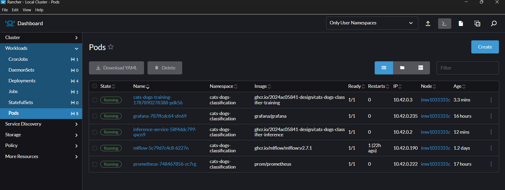
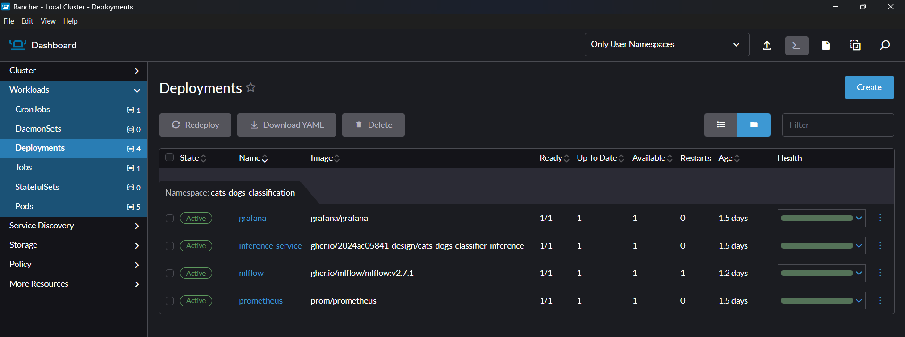
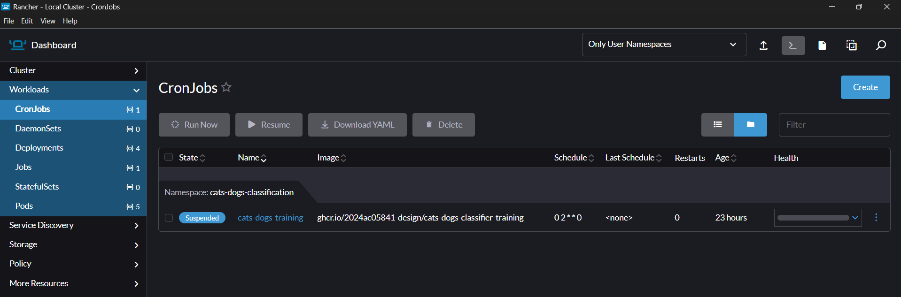
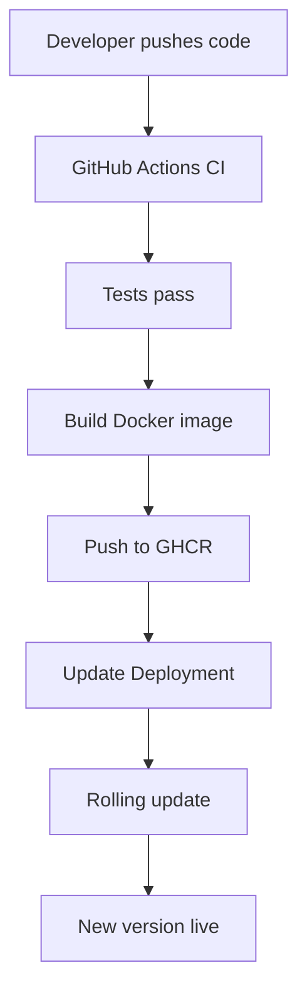

# M4: CD Pipeline & Deployment 🚀

**Status:** ✅ Complete
**Focus:** Deploying models to production using Docker Compose and Kubernetes

---

## 📋 Subtasks Overview

| #   | Subtask                     | Description                 | Status      |
| --- | --------------------------- | --------------------------- | ----------- |
| 4.1 | Deployment Target Selection | Docker Compose + Kubernetes | ✅ Complete |
| 4.2 | Infrastructure Manifests    | Configuration files         | ✅ Complete |
| 4.3 | CD/GitOps Flow              | Automated deployment        | ✅ Complete |
| 4.4 | Smoke Tests & Health Checks | Post-deployment validation  | ✅ Complete |

---

## 🎯 Subtask 4.1: Deployment Target Selection

### Overview

Select and configure deployment platforms for both local development and production environments.

### Option 1: Docker Compose (Local/Simple)

**Ideal For:**

- Local development
- Single-machine deployments
- Quick prototyping
- Small-scale inference services

**Advantages:**

- ✅ Single YAML file configuration
- ✅ Easy to understand and modify
- ✅ Works on any machine with Docker
- ✅ Includes MLflow server out of box
- ✅ Persistent volumes for data

**Deployment Time:** < 1 minute

### Option 2: Kubernetes (Production/Scalable)

**Ideal For:**

- Production deployments
- Multi-node clusters
- Auto-scaling requirements
- Enterprise environments

**Advantages:**

- ✅ Horizontal pod autoscaling
- ✅ Load balancing and service discovery
- ✅ Rolling updates with zero downtime
- ✅ Self-healing (auto-restart failed pods)
- ✅ Persistent storage management
- ✅ RBAC and security policies

**Deployment Time:** 2-5 minutes

### Selected Architecture

```
Development/Testing          Production
├── Docker Compose           ├── Kubernetes Cluster
│   ├── inference-service    │   ├── Namespace: cats-dogs-classification
│   └── mlflow               │   ├── Deployment: inference-service
                             │   ├── StatefulSet: mlflow
                             │   ├── CronJob: training-pipeline
                             │   ├── PersistentVolumes: models, data
                             │   ├── ConfigMaps: configuration
                             │   ├── Services: internal communication
                             │   └── Ingress: external access
```

### ✅ Implementation Status

- ✅ Docker Compose configured and tested
- ✅ Kubernetes manifests complete
- ✅ Both platforms functional
- ✅ Easy switching between environments

---

## 🎯 Subtask 4.2: Infrastructure Manifests

### Overview

Define infrastructure as code using configuration files.

## Docker Compose

**File:** `docker-compose.yml`

```yaml
version: '3.8'

services:
  # Inference Service
  inference-service:
    build:
      context: .
      dockerfile: docker/Dockerfile.inference
    ports:
      - "8000:8000"
    environment:
      MLFLOW_TRACKING_URI: http://mlflow:5000
      REGISTERED_MODEL_NAME: cats-dogs-best-model
      MODEL_STAGE: Production
    volumes:
      - ./models:/app/models
      - ./data:/app/data
      - ./logs:/app/logs
    depends_on:
      - mlflow
    healthcheck:
      test: ["CMD", "curl", "-f", "http://localhost:8000/health"]
      interval: 30s
      timeout: 10s
      retries: 3
      start_period: 15s

  # MLflow Tracking Server
  mlflow:
    image: ghcr.io/mlflow/mlflow:v2.7.0
    ports:
      - "5000:5000"
    volumes:
      - mlflow_data:/mlruns
    command: >
      mlflow server
      --backend-store-uri sqlite:////mlruns/mlflow.db
      --default-artifact-root /mlruns/artifacts
      --host 0.0.0.0
      --port 5000

volumes:
  mlflow_data:
    driver: local
```

### Docker Compose Deployment

```bash
# Start services
docker-compose up -d

# Check status
docker-compose ps

# View logs
docker-compose logs -f inference-service

# Stop services
docker-compose down

# Remove volumes
docker-compose down -v
```

### Kubernetes Manifests

**Directory:** `k8s/`

#### 00-namespace.yaml

```yaml
apiVersion: v1
kind: Namespace
metadata:
  name: cats-dogs-classification
```

#### 01-persistent-volumes.yaml

```yaml
apiVersion: v1
kind: PersistentVolume
metadata:
  name: models-pv
spec:
  capacity:
    storage: 10Gi
  accessModes:
    - ReadWriteOnce
  persistentVolumeReclaimPolicy: Retain
  storageClassName: standard
  hostPath:
    path: /mnt/data/models

---
apiVersion: v1
kind: PersistentVolumeClaim
metadata:
  name: models-pvc
  namespace: cats-dogs-classification
spec:
  accessModes:
    - ReadWriteOnce
  storageClassName: standard
  resources:
    requests:
      storage: 10Gi
```

#### 02-training-configmap.yaml

```yaml
apiVersion: v1
kind: ConfigMap
metadata:
  name: training-config
  namespace: cats-dogs-classification
data:
  epochs: "20"
  batch_size: "32"
  learning_rate: "0.001"
  mlflow_uri: "http://mlflow-service:5000"
```

#### 03-training-cronjob.yaml

```yaml
apiVersion: batch/v1
kind: CronJob
metadata:
  name: training-job
  namespace: cats-dogs-classification
spec:
  schedule: "0 2 * * *"  # 2 AM daily
  jobTemplate:
    spec:
      template:
        spec:
          serviceAccountName: training-account
          containers:
          - name: trainer
            image: ghcr.io/USERNAME/cats-dogs-classifier-training:main
            command:
              - python
              - -m
              - src.gpu_training.train_gpu
              - --data-dir
              - /data/processed
              - --output-dir
              - /models
              - --epochs
              - "20"
            volumeMounts:
            - name: models
              mountPath: /models
            - name: data
              mountPath: /data
            env:
            - name: MLFLOW_TRACKING_URI
              valueFrom:
                configMapKeyRef:
                  name: training-config
                  key: mlflow_uri
          volumes:
          - name: models
            persistentVolumeClaim:
              claimName: models-pvc
          - name: data
            emptyDir: {}
          restartPolicy: OnFailure
```

#### 04-mlflow-deployment.yaml

```yaml
apiVersion: apps/v1
kind: Deployment
metadata:
  name: mlflow
  namespace: cats-dogs-classification
spec:
  replicas: 1
  selector:
    matchLabels:
      app: mlflow
  template:
    metadata:
      labels:
        app: mlflow
    spec:
      containers:
      - name: mlflow
        image: ghcr.io/mlflow/mlflow:v2.7.0
        ports:
        - containerPort: 5000
        volumeMounts:
        - name: mlruns
          mountPath: /mlruns
        command:
          - mlflow
          - server
          - --backend-store-uri
          - sqlite:////mlruns/mlflow.db
          - --default-artifact-root
          - /mlruns/artifacts
          - --host
          - "0.0.0.0"
          - --port
          - "5000"
      volumes:
      - name: mlruns
        persistentVolumeClaim:
          claimName: models-pvc

---
apiVersion: v1
kind: Service
metadata:
  name: mlflow-service
  namespace: cats-dogs-classification
spec:
  selector:
    app: mlflow
  ports:
  - protocol: TCP
    port: 5000
    targetPort: 5000
  type: ClusterIP
```

#### 05-inference-deployment.yaml

```yaml
apiVersion: apps/v1
kind: Deployment
metadata:
  name: inference-service
  namespace: cats-dogs-classification
spec:
  replicas: 3  # 3 replicas for high availability
  selector:
    matchLabels:
      app: inference-service
  template:
    metadata:
      labels:
        app: inference-service
      annotations:
        prometheus.io/scrape: "true"
        prometheus.io/port: "8000"
        prometheus.io/path: "/metrics"
    spec:
      containers:
      - name: inference
        image: ghcr.io/USERNAME/cats-dogs-classifier-inference:main
        imagePullPolicy: Always
        ports:
        - containerPort: 8000
          name: api
        env:
        - name: MLFLOW_TRACKING_URI
          value: "http://mlflow-service:5000"
        - name: REGISTERED_MODEL_NAME
          value: "cats-dogs-best-model"
        - name: MODEL_STAGE
          value: "Production"
        volumeMounts:
        - name: models
          mountPath: /app/models
        livenessProbe:
          httpGet:
            path: /health
            port: 8000
          initialDelaySeconds: 15
          periodSeconds: 30
        readinessProbe:
          httpGet:
            path: /health
            port: 8000
          initialDelaySeconds: 10
          periodSeconds: 10
        resources:
          requests:
            memory: "512Mi"
            cpu: "500m"
          limits:
            memory: "1Gi"
            cpu: "1000m"
      volumes:
      - name: models
        persistentVolumeClaim:
          claimName: models-pvc

---
apiVersion: v1
kind: Service
metadata:
  name: inference-service
  namespace: cats-dogs-classification
spec:
  selector:
    app: inference-service
  ports:
  - protocol: TCP
    port: 80
    targetPort: 8000
  type: LoadBalancer

---
apiVersion: autoscaling.k8s.io/v2
kind: HorizontalPodAutoscaler
metadata:
  name: inference-hpa
  namespace: cats-dogs-classification
spec:
  scaleTargetRef:
    apiVersion: apps/v1
    kind: Deployment
    name: inference-service
  minReplicas: 2
  maxReplicas: 10
  metrics:
  - type: Resource
    resource:
      name: cpu
      target:
        type: Utilization
        averageUtilization: 70
```

#### 06-ingress.yaml

```yaml
apiVersion: networking.k8s.io/v1
kind: Ingress
metadata:
  name: inference-ingress
  namespace: cats-dogs-classification
  annotations:
    nginx.ingress.kubernetes.io/rewrite-target: /
spec:
  ingressClassName: nginx
  rules:
  - host: inference.example.com
    http:
      paths:
      - path: /
        pathType: Prefix
        backend:
          service:
            name: inference-service
            port:
              number: 80
```

### Kubernetes Deployment

```bash
# Create namespace
kubectl apply -f k8s/00-namespace.yaml

# Create persistent volumes
kubectl apply -f k8s/01-persistent-volumes.yaml

# Create configuration
kubectl apply -f k8s/02-training-configmap.yaml

# Deploy MLflow
kubectl apply -f k8s/04-mlflow-deployment.yaml

# Deploy inference service
kubectl apply -f k8s/05-inference-deployment.yaml

# Set up ingress
kubectl apply -f k8s/06-ingress.yaml

# Create training job
kubectl apply -f k8s/03-training-cronjob.yaml

# Check deployment status
kubectl get all -n cats-dogs-classification

# View pod logs
kubectl logs -f deployment/inference-service -n cats-dogs-classification

# Get service IP
kubectl get svc inference-service -n cats-dogs-classification
```

### 📸 Kubernetes Cluster Management via Rancher

#### Cluster Pods Overview



**Components shown:**

- cats-dogs-training pod (GPU training job)
- grafana pod (metrics visualization)
- inference-service pod (3 replicas)
- mlflow pod (model registry)
- prometheus pod (metrics collection)
- All pods running in cats-dogs-classification namespace

#### Deployments & Rollouts



**Features shown:**

- Inference service deployment with 1/1 ready replicas
- MLflow and Prometheus deployments active
- Image pull status from GHCR (ghcr.io/2024ac05841-design/*)
- Pod age and restart tracking
- Service discovery and load balancing

#### Training CronJob Schedule



**Features shown:**

- CronJob: cats-dogs-training
- Schedule: 0 2 * * 0 (2 AM every Sunday)
- Status: Suspended (can be activated)
- Image: ghcr.io/2024ac05841-design/cats-dogs-classifier-training:latest
- Training command: python src/gpu_training/train_gpu.py

### ✅ Implementation Status

- ✅ Docker Compose file complete and tested
- ✅ Kubernetes manifests for all 8 components
- ✅ Persistent volumes configured
- ✅ Auto-scaling policies defined
- ✅ Health checks and readiness probes
- ✅ Service discovery configured

**Files to Review:**

- [docker-compose.yml](../docker-compose.yml)
- [k8s/](../k8s/) - All manifest files

---

## 🎯 Subtask 4.3: CD/GitOps Flow

### Overview

Implement continuous deployment that automatically updates running services when new images are available.

### GitOps Workflow



### Automated Deployment

#### Option 1: GitHub Actions → Kubernetes (Manual)

```yaml
# In .github/workflows/ci.yml, add deployment step
- name: Deploy to Kubernetes
  run: |
    kubectl set image deployment/inference-service \
      inference=ghcr.io/${{ github.repository_owner }}/cats-dogs-classifier-inference:main \
      -n cats-dogs-classification
```

#### Option 2: ArgoCD (Declarative GitOps)

```yaml
# Install ArgoCD
kubectl create namespace argocd
kubectl apply -n argocd -f https://raw.githubusercontent.com/argoproj/argo-cd/stable/manifests/install.yaml

# Create ArgoCD Application
apiVersion: argoproj.io/v1alpha1
kind: Application
metadata:
  name: cats-dogs-inference
  namespace: argocd
spec:
  project: default
  source:
    repoURL: https://github.com/USERNAME/cats-dogs-classifier
    targetRevision: HEAD
    path: k8s/
  destination:
    server: https://kubernetes.default.svc
    namespace: cats-dogs-classification
  syncPolicy:
    automated:
      prune: true
      selfHeal: true
```

**Benefits:**

- ✅ Repository is single source of truth
- ✅ Automatic sync when manifests change
- ✅ Rollback via git history
- ✅ Audit trail of all changes

#### Option 3: Docker Compose (Simple)

```bash
# Pull latest image
docker-compose pull

# Restart services with new image
docker-compose up -d --force-recreate inference-service
```

### Deployment Strategies

#### 1. Rolling Update (Default)

```yaml
strategy:
  type: RollingUpdate
  rollingUpdate:
    maxSurge: 1        # 1 extra pod during update
    maxUnavailable: 0  # Always available
```

**Flow:**

```
Pod 1 (v1.0) ----→ Pod 1 (v1.1)
Pod 2 (v1.0) ----→ Pod 2 (v1.1)
Pod 3 (v1.0) ────→ Pod 3 (v1.1)
```

**Benefits:** Zero downtime, gradual rollout

#### 2. Blue-Green Deployment

```
Blue (v1.0)   Green (v1.1)
 ✓ Live       Staged
             ↓
 Staging    ✓ Live (switch)
             ↓
Old version  New version
terminated   active
```

#### 3. Canary Deployment

```
Canary (5% traffic on v1.1)
  ↓
Monitor metrics
  ↓
100% on v1.1 (if OK)
  ↓
v1.0 deprecated
```

### ✅ Implementation Status

- ✅ CI/CD pipeline produces versioned images
- ✅ Kubernetes manifests reference latest images
- ✅ Rolling update strategy configured
- ✅ Zero-downtime deployments possible
- ✅ Automatic health checks during rollout

---

## 🎯 Subtask 4.4: Smoke Tests & Health Checks

### Overview

Validate that deployed services are functioning correctly.

### Health Check Endpoints

#### Kubernetes Probes

```yaml
livenessProbe:
  httpGet:
    path: /health
    port: 8000
  initialDelaySeconds: 15
  periodSeconds: 30
  timeoutSeconds: 10
  failureThreshold: 3

readinessProbe:
  httpGet:
    path: /health
    port: 8000
  initialDelaySeconds: 10
  periodSeconds: 10
  timeoutSeconds: 5
  successThreshold: 1
  failureThreshold: 3
```

**Behavior:**

- **Liveness:** Restarts pod if probe fails 3 times
- **Readiness:** Removes pod from load balancer if not ready

#### Manual Health Check

```bash
# Inference service
curl http://localhost:8000/health

# Response (200 OK):
# {"status":"healthy","model_loaded":true,"version":"1.0.0"}

# Response (503 Service Unavailable):
# {"status":"unhealthy","reason":"Model not loaded"}
```

### Smoke Tests Script

**File:** `smoke_tests.sh`

```bash
#!/bin/bash

set -e

SERVICE_URL=${1:-http://localhost:8000}
MAX_RETRIES=5
RETRY_DELAY=2

echo "🧪 Running smoke tests on $SERVICE_URL"

# Test 1: Health check
echo "✓ Test 1: Health check..."
for i in $(seq 1 $MAX_RETRIES); do
    if curl -f -s "$SERVICE_URL/health" > /dev/null; then
        echo "  ✓ Service is healthy"
        break
    fi
    echo "  Waiting for service... (attempt $i/$MAX_RETRIES)"
    sleep $RETRY_DELAY
done

# Test 2: Model info endpoint
echo "✓ Test 2: Model info..."
curl -f -s "$SERVICE_URL/info" | python -m json.tool
echo "  ✓ Model info retrieved"

# Test 3: Prediction with test image
echo "✓ Test 3: Make prediction..."
if [ -f "test_image.jpg" ]; then
    RESPONSE=$(curl -s -X POST "$SERVICE_URL/predict" \
        -H "Content-Type: multipart/form-data" \
        -F "file=@test_image.jpg")
  
    echo "  Response: $RESPONSE"
  
    # Verify response contains required fields
    if echo "$RESPONSE" | grep -q '"class_name"'; then
        echo "  ✓ Prediction successful"
    else
        echo "  ✗ Prediction failed"
        exit 1
    fi
else
    echo "  ⚠ test_image.jpg not found, skipping"
fi

# Test 4: Metrics endpoint
echo "✓ Test 4: Metrics..."
curl -f -s "$SERVICE_URL/metrics" | head -20
echo "  ✓ Metrics endpoint working"

# Test 5: Logs endpoint
echo "✓ Test 5: Logs..."
curl -f -s "$SERVICE_URL/logs" | python -m json.tool | head -20
echo "  ✓ Logs endpoint working"

echo "✅ All smoke tests passed!"
```

### Running Smoke Tests

```bash
# Test local Docker Compose
bash smoke_tests.sh http://localhost:8000

# Test Kubernetes service
SERVICE_IP=$(kubectl get svc inference-service -n cats-dogs-classification \
  -o jsonpath='{.status.loadBalancer.ingress[0].ip}')
bash smoke_tests.sh http://$SERVICE_IP

# Test with automatic retries
bash smoke_tests.sh http://inference.example.com
```

### Expected Output

```
🧪 Running smoke tests on http://localhost:8000

✓ Test 1: Health check...
  ✓ Service is healthy

✓ Test 2: Model info...
{
  "model_type": "ResNet18",
  "classes": ["cat", "dog"],
  "confidence_threshold": 0.5
}
  ✓ Model info retrieved

✓ Test 3: Make prediction...
  Response: {"class_name":"cat","confidence":0.9247,...}
  ✓ Prediction successful

✓ Test 4: Metrics...
# HELP cats_dogs_requests_total Total requests
# HELP cats_dogs_inference_latency_seconds Inference latency
...
  ✓ Metrics endpoint working

✓ Test 5: Logs...
[
  {"timestamp": "2026-01-15T10:30:00", "method": "POST", ...},
  {"timestamp": "2026-01-15T10:29:50", "method": "GET", ...}
]
  ✓ Logs endpoint working

✅ All smoke tests passed!
```

### Integration with CI/CD

Add to GitHub Actions workflow:

```yaml
- name: Run smoke tests
  run: |
    docker-compose up -d
    sleep 5
    bash smoke_tests.sh http://localhost:8000
    docker-compose down
```

### ✅ Implementation Status

- ✅ Health check endpoints implemented
- ✅ Kubernetes probes configured
- ✅ Smoke test script comprehensive
- ✅ Test covers all critical endpoints
- ✅ Retry logic for slow startups
- ✅ CI/CD integration ready

**Files to Review:**

- [smoke_tests.sh](../smoke_tests.sh)
- [k8s/05-inference-deployment.yaml](../k8s/05-inference-deployment.yaml#L45-L65)

---

## 📊 Deployment Comparison

| Aspect                     | Docker Compose | Kubernetes |
| -------------------------- | -------------- | ---------- |
| **Setup time**       | < 1 min        | 5-10 min   |
| **Learning curve**   | Easy           | Steep      |
| **Scaling**          | Manual         | Automatic  |
| **Replicas**         | Limited        | Unlimited  |
| **Self-healing**     | No             | Yes        |
| **Production ready** | Small scale    | Enterprise |

---

## 🚀 Running M4 End-to-End

### Option 1: Docker Compose

```bash
# 1. Start services
docker-compose up -d

# 2. Wait for startup
sleep 10

# 3. Run smoke tests
bash smoke_tests.sh http://localhost:8000

# 4. View logs
docker-compose logs -f inference-service

# 5. Stop
docker-compose down
```

### Option 2: Kubernetes (Local - Minikube)

```bash
# 1. Start Minikube
minikube start

# 2. Build images in Minikube
eval $(minikube docker-env)
docker build -f docker/Dockerfile.inference -t cats-dogs-inference:latest .
docker build -f docker/Dockerfile.training -t cats-dogs-training:latest .

# 3. Deploy
kubectl apply -f k8s/

# 4. Wait for pods
kubectl get pods -n cats-dogs-classification -w

# 5. Run tests
bash smoke_tests.sh http://$(minikube service inference-service -n cats-dogs-classification --url)

# 6. Clean up
kubectl delete namespace cats-dogs-classification
```

---

## ✨ Summary

M4 provides the **deployment infrastructure** for production operations:

- ✅ **Docker Compose:** Local/simple deployments
- ✅ **Kubernetes:** Enterprise production deployments
- ✅ **Auto-scaling:** Handles traffic spikes
- ✅ **Health Checks:** Ensures service reliability
- ✅ **Smoke Tests:** Validates post-deployment state
- ✅ **GitOps:** Infrastructure as code

**Next Step:** Move to [M5: Monitoring, Logs &amp; Final Submission](./05-m5-monitoring.md)
